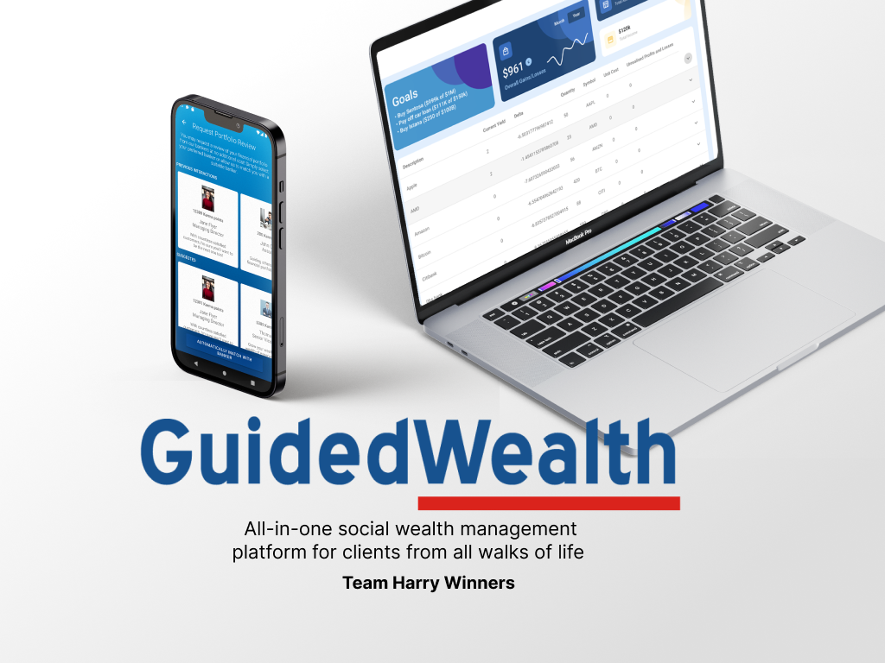

# GuidedWealth - Team Harry Winners
Ian Goh  
Ho Rui En  
Kellie Sim  
Lee Wai Shun  
Joel Tay

## Running the code
The code consists of two applications:
- Native Android App for Client
- React WebApp for Banker

### Run Client Application
The client application can be opened in Android Studio Chipmunk by opening the project folder `GuidedWealth_Clients`.

### Run Banker Application
The banker application can be run by first running `yarn` in the `GuidedWealth_Bankers` directory. This will install all required dependencies.

To run the application, use the command `yarn start` to run a local development server. The webpage can be accessed by enterint `localhost:3000` in a web browser.
